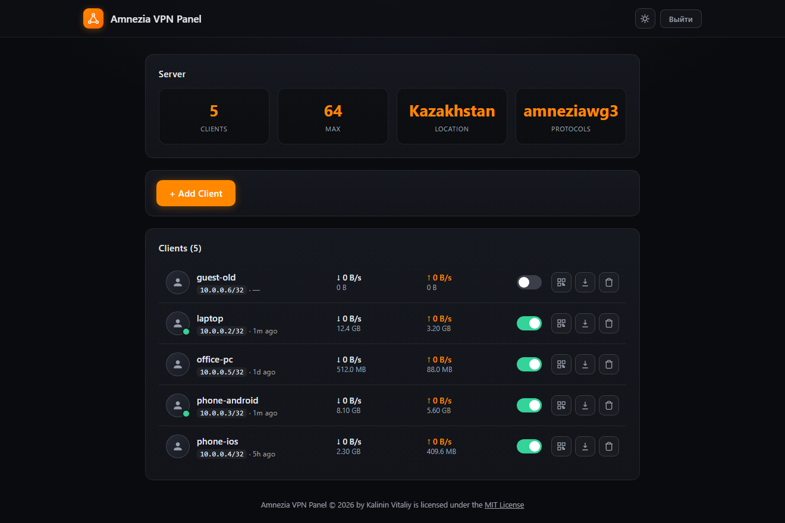
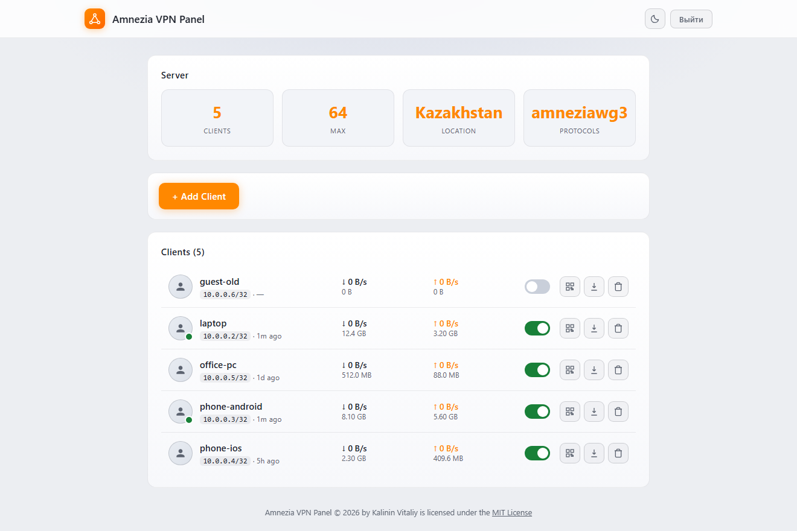

# Amnezia VPN Panel

[](LICENSE)
[](https://github.com/kalininvv1974/amnezia-vpn-panel/releases)
[](https://github.com/kalininvv1974/amnezia-vpn-panel/stargazers)
[](#установка-на-чистый-ubuntudebian-сервер)

🌐 **English** — [README.md](README.md)

Веб-панель управления для **AmneziaVPN / AmneziaWG** с входом по форме (логин/пароль), списком клиентов, трафиком, QR‑кодами и скачиванием `.conf`. Дизайн — в стиле wg‑easy, работает на nginx + Node.js.

**Поддерживаемые протоколы:** AmneziaWG, AmneziaWG 3.0

> ⚠️ Панель **не устанавливает AmneziaVPN**. Сначала поставьте AmneziaVPN своим инсталлятором (должен работать контейнер `amnezia-awg*`), затем этой панелью — удобный web‑интерфейс управления.

## Возможности

- 🔐 **Форма входа внутри панели** (session‑cookie, PBKDF2) — без браузерного окна Basic Auth; пароль запрашивается заново при каждом новом открытии браузера
- 📋 Список клиентов: IP, статус (Online/Offline/Disabled), скорость и суммарный трафик
- ➕ Создание клиента одним кликом + авто‑скачивание `amnezia-<имя>.conf`
- 📱 QR‑код конфига для приложения Amnezia
- 🔌 Включение/выключение клиента тумблером, удаление
- 🌙 Тёмная/светлая тема с переключателем в шапке
- 🌍 Карточка Server: число клиентов, локация (страна по GeoIP), протоколы

## Скриншоты

| Тёмная тема | Светлая тема |
|---|---|
|  |  |

## Установка на чистый Ubuntu/Debian сервер

**Быстрый способ — одной командой (с сервера, под root):**

```bash
wget -O install.sh https://raw.githubusercontent.com/kalininvv1974/amnezia-vpn-panel/main/install-amnezia-panel.sh
bash install.sh
```

Если `wget` не установлен — через `curl`:

```bash
curl -fsSL -o install.sh https://raw.githubusercontent.com/kalininvv1974/amnezia-vpn-panel/main/install-amnezia-panel.sh
bash install.sh
```

**Классический способ — загрузить скрипт со своего ПК по scp:**

```bash
# 1. Загрузить скрипт на сервер
scp install-amnezia-panel.sh root@YOUR_IP:/root/

# 2. Подключиться по SSH
ssh root@YOUR_IP

# 3. Запустить установку
cd /root
bash install-amnezia-panel.sh
```

## Что спросит скрипт
1. **IP сервера** — например `203.0.113.10`
2. **API ключ** — внутренний ключ панель↔API (Enter — будет сгенерирован случайный; можно ввести свой, ≥ 32 символов)
3. **Логин панели** — Enter = `admin`
4. **Пароль панели** — Enter = будет сгенерирован случайный (сохраните его!)

## Предварительно
- Уже установлен работающий **AmneziaVPN** (контейнер `amnezia-awg*`, общий ключ `awg0.conf`)
- Ubuntu 20.04+ или Debian 11+
- Минимум 1 GB RAM
- Открыты порты: `80/tcp` и UDP‑порт AmneziaVPN (по умолчанию контейнера — `31509/udp`)
- Доступ в интернет для скачивания пакетов

## Что установится
- Node.js 20
- `amnezia-api` (клонируется с GitHub) — Node/Fastify, **systemd-сервис** `amnezia-api.service`, слушает `127.0.0.1:4001` (наружу только через nginx)
- `amnezia-panel-auth` — маленький auth-сервис (**systemd**, `127.0.0.1:4002`): проверяет логин/пароль (PBKDF2) и выдаёт session‑cookie
- Nginx — раздаёт панель на 80 порту с **формой входа внутри панели** и проксирует `/api` (доступ к API — только с валидной сессией, через `auth_request`)
- Контейнер `amnezia-awg*` (AmneziaWG) **не создаётся и не меняется** — скрипт только копирует `awg0.conf` и ключи из уже работающего контейнера

## После установки

Просто откройте в браузере:
```
http://YOUR_IP/
```
Откроется **форма входа** (логин и пароль, задаются при установке). Сессия — session‑cookie: **пароль запрашивается заново при каждом новом открытии браузера** (плюс есть кнопка «Выйти»).

API документация (только после входа в панель):
```
http://YOUR_IP/api/docs
```

> Панель сама общается с API по заголовку `x-api-key` — вводить его вручную при каждом входе не нужно.

## Сервер с ispmanager (хостинг-панель)
Если на сервере уже стоит ispmanager со своими сайтами:
- панель размещается в общем nginx (как обычный vhost `panel`) — default‑сервер на порту 80, вход через форму внутри панели (session‑cookie). Сайты по своим доменам не затрагиваются;
- установщик **не** переустанавливает и **не** удаляет nginx/nginx‑пакеты;
- деинсталлятор удаляет только панель (index.html, vhost `panel`, auth-сервис) и **не трогает** ispmanager, его сайты и `/etc/nginx`.

## Файлы
- `install-amnezia-panel.sh` — установочный скрипт (панель вшита в него base64)
- `index.html` — исходник панели (для разработки; при установке берётся версия из скрипта)
- `uninstall-amnezia-panel.sh` — удаление панели/API и настроек панели в nginx (сам nginx не трогает)

## Если что-то пошло не так

### Проверить статус сервисов
```bash
docker ps -a
systemctl status amnezia-api
journalctl -u amnezia-api -f
systemctl status nginx
```

### Перезапустить сервисы
```bash
systemctl restart amnezia-api
systemctl restart nginx
```

### Проверить панель и API
```bash
# Страница панели (ожидается 200)
curl -o /dev/null -w "%{http_code}\n" http://127.0.0.1/
# /api без сессии (ожидается 401)
curl -o /dev/null -w "%{http_code}\n" http://127.0.0.1/api/server
# Логин по паролю -> cookie (ожидается 200)
curl -s -c /tmp/s.txt -o /dev/null -w "%{http_code}\n" -X POST -H 'Content-Type: application/json' \
  -d '{"user":"ЛОГИН","password":"ПАРОЛЬ"}' http://127.0.0.1/api/auth/login
# /api с сессией (ожидается 200)
curl -s -b /tmp/s.txt -o /dev/null -w "%{http_code}\n" http://127.0.0.1/api/server
rm -f /tmp/s.txt
# API напрямую (только локально)
curl -s http://127.0.0.1:4001/clients -H "x-api-key: ВАШ_API_КЛЮЧ"
```

### Сменить пароль панели
```bash
node -e '
  const fs = require("fs"), crypto = require("crypto");
  const pass = process.argv[1];
  const salt = crypto.randomBytes(16).toString("hex");
  const secret = crypto.randomBytes(32).toString("hex");
  const iterations = 100000;
  const hash = crypto.pbkdf2Sync(pass, salt, iterations, 32, "sha256").toString("hex");
  const old = JSON.parse(fs.readFileSync("/etc/amnezia-panel/auth.json", "utf8"));
  fs.writeFileSync("/etc/amnezia-panel/auth.json",
    JSON.stringify({ user: old.user, salt, hash, secret, iterations }));
' 'новый_пароль'
chmod 600 /etc/amnezia-panel/auth.json
systemctl restart amnezia-panel-auth
```

### Сменить внутренний API-ключ
```bash
# Новый ключ (>= 32 символов)
nano /opt/amnezia-api/.env            # FASTIFY_API_KEY=новый_ключ
systemctl restart amnezia-api
# Обновить ключ в панели
sed -i "s|старый_ключ|новый_ключ|g" /var/www/html/index.html
```

### Полностью удалить
```bash
bash uninstall-amnezia-panel.sh
```
Скрипт удаляет панель, API и настройки панели в nginx; контейнер AmneziaVPN **не трогает**.

## Лицензия

© 2026 Kalinin Vitaliy. **Amnezia VPN Panel** распространяется под лицензией [MIT License](https://opensource.org/licenses/MIT).

Встроенные компоненты сохраняют собственные лицензии:
- QR‑код библиотека (в `index.html`) — Kazuhiko Arase, MIT
- [pako](https://github.com/nodeca/pako) — MIT/BSD (подключается с CDN)